# [User-centric frontend development.GIT](https://rjm8989.github.io/WDA-project-one)

This project was to design a front-end website for Darren's Barbershop, based on a real-life barbershop in London called Austin's Barbershop. The aim of this project was that the website would generate traffic from a wider audience to help increase the number of new customers for the business as well as cater for existing customers through the use of a booking form. The website also has information for new and existing customers such as a description of each barber, the address, a Google map, etc...

--------

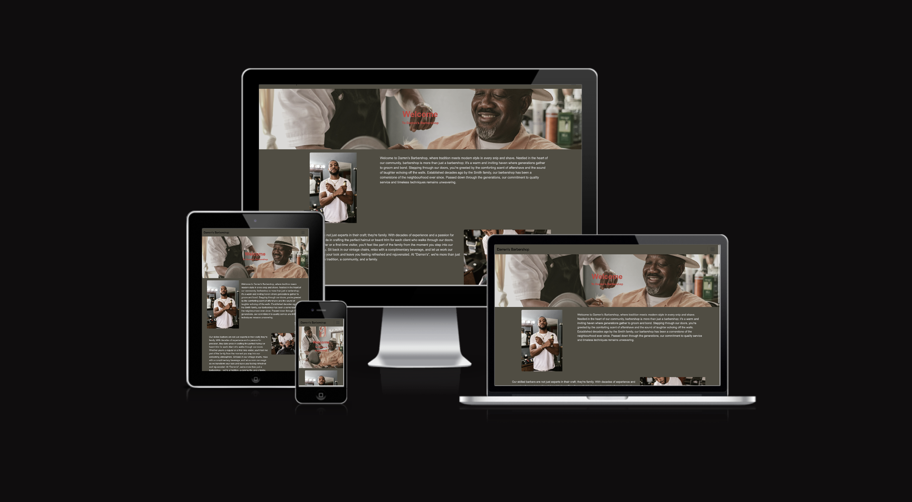

source: [amiresponsive](https://ui.dev/amiresponsive?url=https://rjm8989.github.io/WDA-project-one)

## UX

The strategy of the website was to promote the business and attract both physical and virtual traffic. To achieve this, I researched similar websites to analyze how they advertised their business and the services they offered. Based on my research for the scope, I decided to include a price list, the business location, and a way for users to interact with the website, which led me to include a contact form and a booking form. Additionally, I added pictures of the staff and the services offered on the website.

For the skeleton and structure of the website, I used Figma for the wireframes. I decided to have a simple navbar at the top of the page, with three pages: Home, Contact/Meet the Team, and Price List. The Home page included an introduction and pictures of hairstyles and previous customers. The Contact/Meet the Team page introduced the staff and provided information such as the business location, opening times, a map, and a contact form. Finally, the Price List page listed the services and allowed users to book a service and choose their preferred barber.

At the surface level, I added a carousel to the website, so users could look at pictures of the business. For the location, I chose a Google map because it was interactive and provided information on transport links and landmarks. The contact and book forms had multicoloured buttons to improve accessibility, and I chose a colour scheme that contrasted bold and bright colours with brown, red, and silver grey for the text.

### Colour Scheme

Explain your colours and the colour scheme.

- `#D9D9D9` used for primary text.
- `#514d42` used for primary background color.
- `#8f8f8f` used for buttons and social media links.
- `#A30B37` used for button hover feature.

I used [coolors.co](https://coolors.co/514d42-d9d9d9-a30b370) to generate my colour palette.

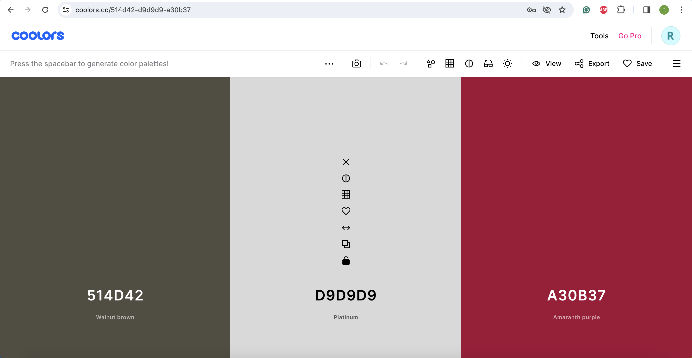

### Typography

- [Open Sans](https://fonts.google.com/specimen/Open+Sans) was used for the primary headers, titles, and all other secondary text.

- [Font Awesome](https://fontawesome.com) icons were used throughout the site, such as the social media icons in the footer.

## User Stories

### New Site Users

- As a new site user, I want to be able to find the location I need quickly so that I don’t have to waste time browsing Google Maps.
- As a new site user, I want to be able to find the price list quickly so that I can find the prices of the services offered.
- As a new site user, I want to be able to see different hairstyles so that I can see the haircuts I would prefer.
- As a new site user, I would like to you the contact form, so that I can enquire about of one the services offered.
- As a new site user, I would like to use the social media links, so that I can follow the business online.

### Returning Site Users

- As a returning site user, I would like to be able to book an appointment, the booking form would allow me to do this.
- As a returning site user, I would like to use the booking form, so that I can pick my preferred barber.
- As a returning site user would like to use the social media links so that I can keep updated on the business online.
- As a returning site user, I want to be able to see different hairstyles so that I can see the haircuts I would prefer.
- As a returning site user, I want to be able to find the price list I need quickly so that compare the prices of the services offered.

## Wireframes

To follow best practice, wireframes were developed for mobile and desktop sizes.
I've used both [Balsamiq](https://balsamiq.com/wireframes/) and [Figma](https://www.figma.com/files/recents-and-sharing/recently-viewed?fuid=1312128635675800480) to design my site wireframes.

### Desktop Wireframes

These screenshots were taken before the start of the project throughout the design process the pages have slight variations compared to the original wireframe.

[Click here to see the Desktop Wireframes](https://www.figma.com/file/lLJEQAOiVQzq88ahDIDnvT/Project-One-wireframe?type=design&node-id=0%3A1&mode=design&t=P8iwzpm4nrJ0ixg6-1)

Home
  - 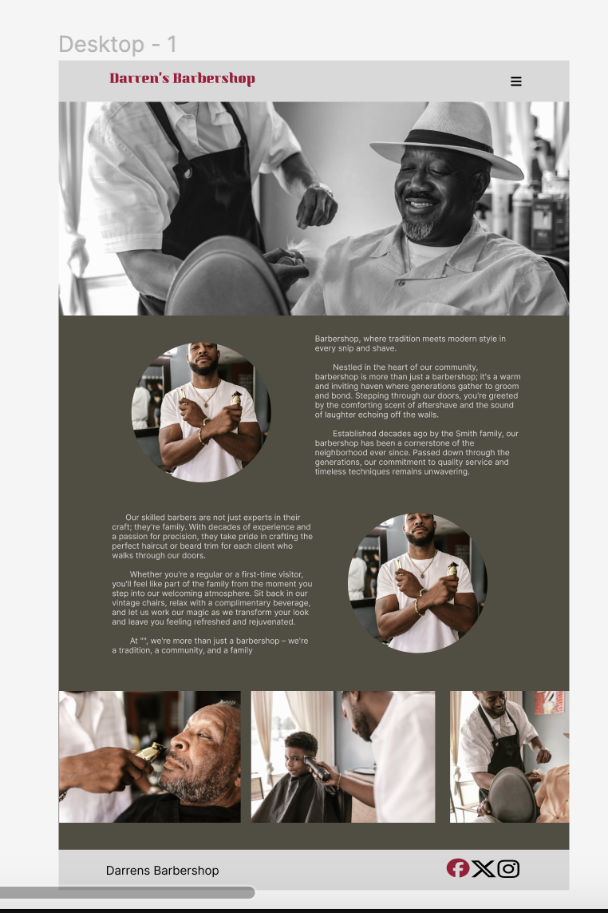

Meet The Team/Contact
  - 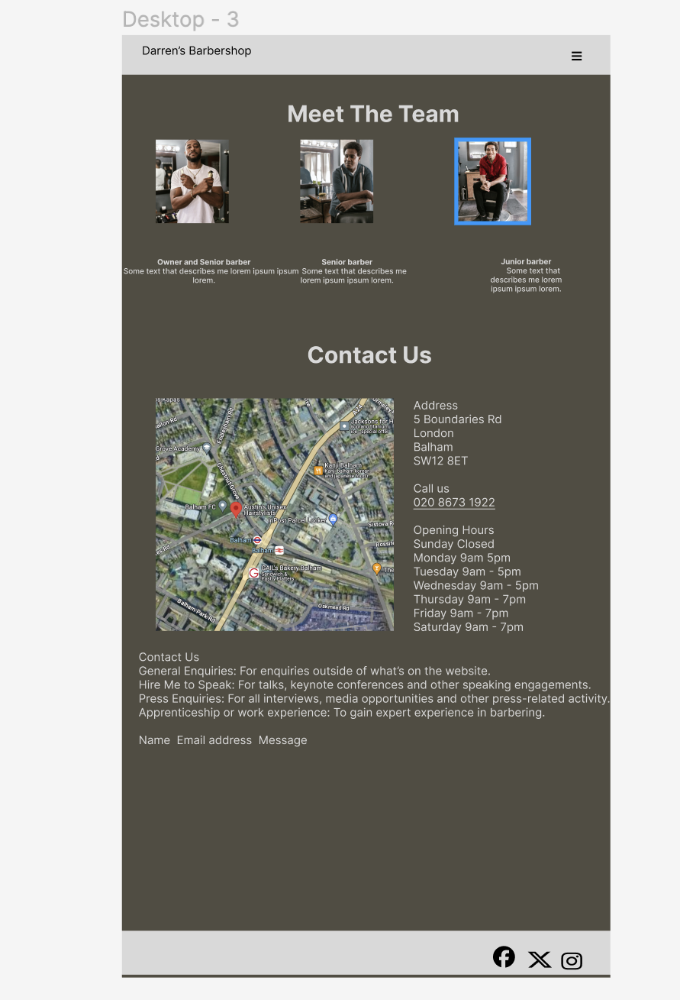

Price List
  - 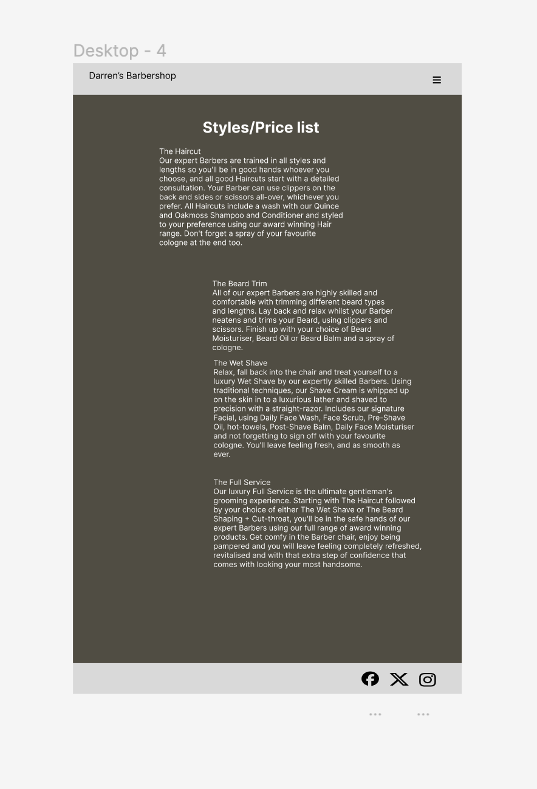

### Mobile Wireframes

[Click here to see the Mobile Wireframes](https://balsamiq.cloud/sgt4xn/pej4pfk)

Home
  - 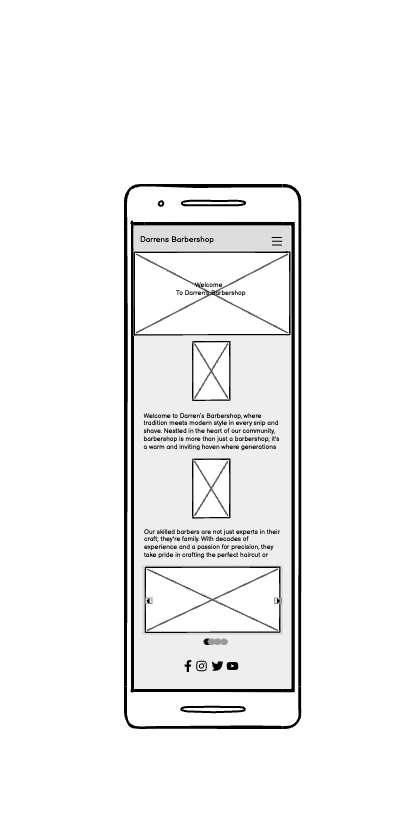

Meet The Team/Contact
  - 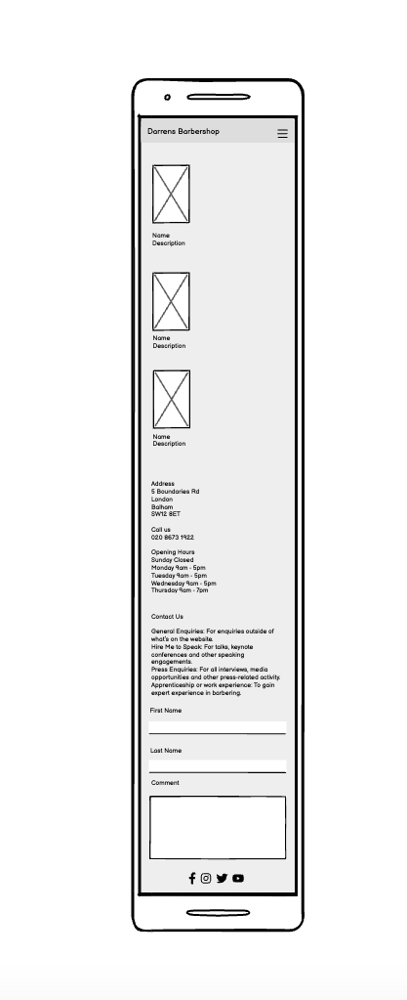

Price List
  - 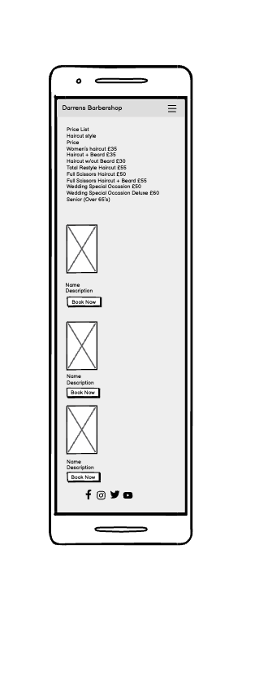

## Features

### Existing Features

- **NAVBAR**

    - The navbar is an interactive feature on the website that allows users to navigate around, the benefit to the site is that it allows users to navigate the website easier and find the pages they're either on or want to find. 
    

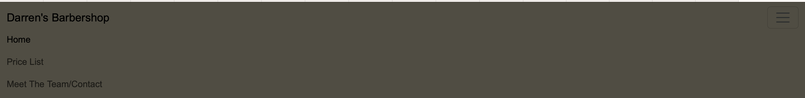

- **CAROUSEL**

    - The carousel is an interactive feature on the website that allows images to be added to the website, to help advertise the business. 
    At the moment it contains pictures of customers and the staff that work at the company. it allows the user to see the types of haircuts available and familiarise themselves with the staff.

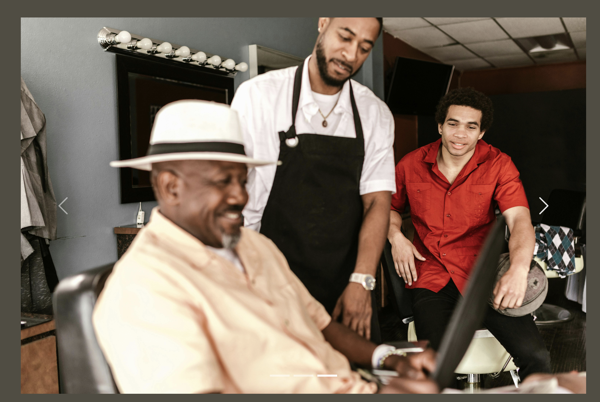

- **SOCIAL MEDIA LINKS**

    - The social media links show the various social media apps used by the business. It helps to build loyalty and trust in your brand, to help advertise the business, and to interact directly with customers in real time. It allows the user to interact with the business.

- **GOOGLE MAPS**

    - The Map shows the business location, the benefit of the Google map is that it's interactive and shows landmarks and transport links around the business. The benefit for the user is that it’s an interactive map so both existing and current users can plan their journey to the business.

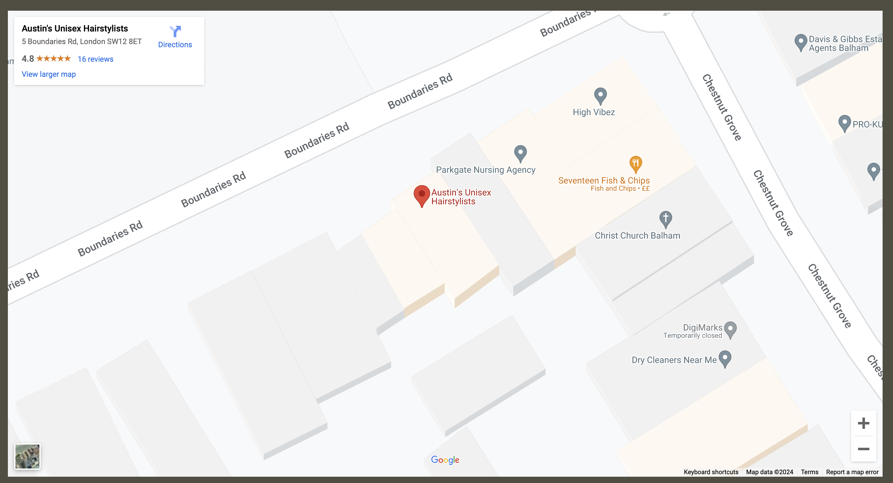

- **PRICE LIST**

    - The price list is a useful communication tool it shows the services offered and the price of the services provided by the business, the benefit of the price list is that the user knows how much a service is and what is on offer at the business.

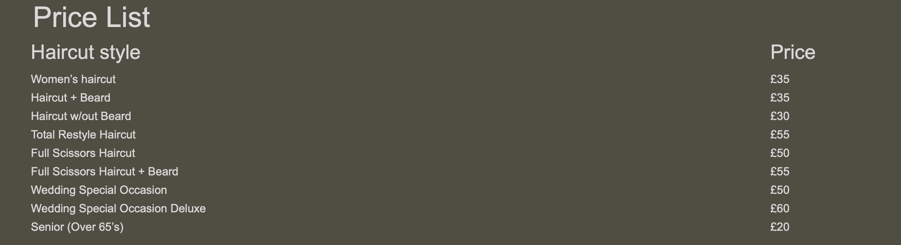

- **BOOKING FORM**

    - The booking form is a useful communication tool that allows both new and existing users, the benefit of the booking form is that new and existing users can book a service, with the staff member they prefer on a chosen day and time they prefer. The business benefit is that it opens up the business to a wider audience and encourages more users.

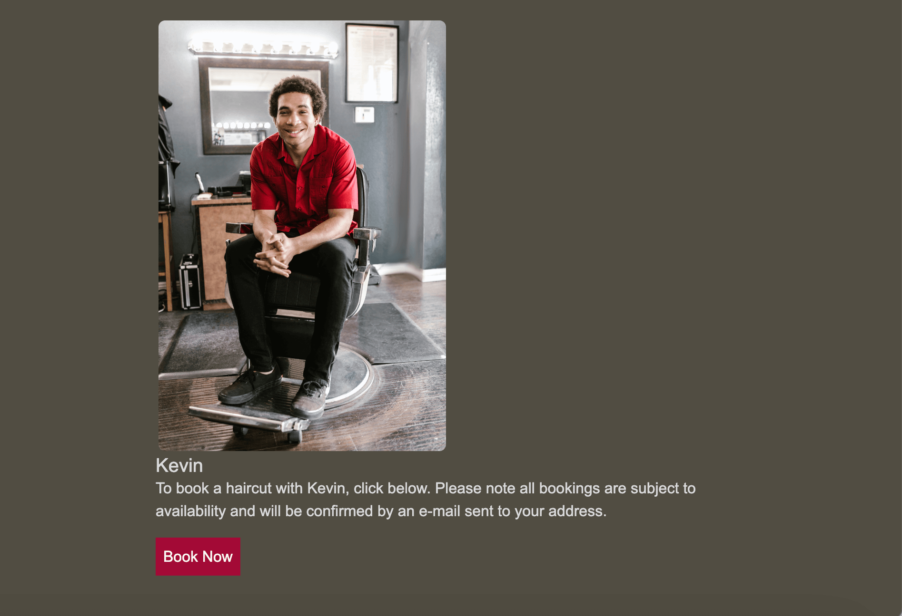

### Future Features

- BOOKING FORM AND CONTACT US FORM
    
   - A number of the limitations are both the booking form and the contact us form. The Contact Us form on HTML only allows a response sent message, whereas, with a back-end application such as PHP I can design an interactive contact form, an e-mail would be sent to the address of the inquiry, alongside a message confirming acknowledgment, and JavaScript so I can design an interactive booking form where it would have a calendar and a time to book a particular service and a preferred barber, the availability of the barbers and the ability to pay for services directly online and more interaction with customers, for example, the Pall Mall barbershop [website](https://www.pallmallbarbers.com/) you can see how much better the interaction with customers is. They have a booking form via a booking service like the Fresha online booking app [website](https://www.fresha.com/), with multiple locations available, a calendar, and a choice of staff and service.

- GOOGLE REVIEWS
    - Google reviews can increase online visibility and exposure, and positive reviews can boost your search engine rankings which in turn increases your online visibility and traffic. increase brand trust because people trust reviews from other customers. They also improve customer experience and help you gain a competitive advantage through both negative and positive feedback and customer interaction when a review is submitted, businesses can respond and engage with that customer.

## Tools & Technologies Used

-  used to generate README and TESTING templates.
-  used for version control. (`git add`, `git commit`, `git push`)
-  used for secure online code storage.
-  used as my local IDE for development.
-  used for the main site content.
-  used for the main site design and layout.
-  used for hosting the deployed front-end site.
-  used as the front-end CSS framework for modern responsiveness and pre-built components.
-  used for the icons.
-  used to help debug, troubleshoot, and explain things.

## Testing

> [!NOTE]  
> For all testing, please refer to the [TESTING.md](TESTING.md) file.

## Deployment

The site was deployed to GitHub Pages. The steps to deploy are as follows:

- In the [GitHub repository](https://github.com/RJM8989/WDA-project-one.git), navigate to the Settings tab 
- From the source section drop-down menu, select the **Main** Branch, then click "Save".
- The page will be automatically refreshed with a detailed ribbon display to indicate the successful deployment.

The live link can be found [here](https://rjm8989.github.io/WDA-project-one)

### Local Deployment

This project can be cloned or forked in order to make a local copy on your own system.

#### Cloning

You can clone the repository by following these steps:

1. Go to the [GitHub repository](https://github.com/RJM8989/WDA-project-one.git) 
2. Locate the Code button above the list of files and click it 
3. Select if you prefer to clone using HTTPS, SSH, or GitHub CLI, and click the copy button to copy the URL to your clipboard
4. Open Git Bash or Terminal
5. Change the current working directory to the one where you want the cloned directory
6. In your IDE Terminal, type the following command to clone my repository:
	- `git clone https://github.com/RJM8989/WDA-project-one.git.git`
7. Press Enter to create your local clone.

Alternatively, if using Gitpod, you can click below to create your own workspace using this repository.

Please note that in order to directly open the project in Gitpod, you need to have the browser extension installed.
A tutorial on how to do that can be found [here](https://www.gitpod.io/docs/configure/user-settings/browser-extension).

#### Forking

By forking the GitHub Repository, we make a copy of the original repository on our GitHub account to view and/or make changes without affecting the original owner's repository.
You can fork this repository by using the following steps:

1. Log in to GitHub and locate the [GitHub Repository](https://github.com/RJM8989/WDA-project-one.git)
2. At the top of the Repository (not the top of the page) just above the "Settings" Button on the menu, locate the "Fork" Button.
3. Once clicked, you should now have a copy of the original repository in your own GitHub account!

### Local VS Deployment

As far as I’m aware, there are no differences between the local version and the live deployment.

## Credits

### Content

| Source | Location | Notes |
| --- | --- | --- |
| [Markdown Builder](https://tim.2bn.dev/markdown-builder) | README and TESTING | tool to help generate the Markdown files |
| [Chris Beams](https://chris.beams.io/posts/git-commit) | version control | "How to Write a Git Commit Message" |
| [W3Schools](https://www.w3schools.com/css/css_link.asp) | CSS Links, A link styled as button | Booking Form buttons |
| [W3Schools](https://www.w3schools.com/howto/howto_css_blurred_background.asp) | Hero Image | blurred box on hero image |
| [W3Schools](https://www.w3schools.com/howto/howto_css_contact_section.asp) | Contact form | interactive contact form |
| [Bootstrap](https://getbootstrap.com/docs/5.3/components/carousel/) | Carousel | pictures on home page |
| [Bootstrap](https://getbootstrap.com/docs/5.3/content/tables/) | Tables | table for the pricelist |
| [Bootstrap](https://getbootstrap.com/docs/5.3/components/card/) | Card | for meet the team and booking page |
| [Bootstrap](https://getbootstrap.com/docs/5.3/components/navbar/) | Navbar |  responsive HTML/CSS navbar |
| [HubSpot](https://blog.hubspot.com/website/how-to-embed-google-map-in-html)| How to Embed Google Map in HTML| Google map |
| [Stack Overflow](https://stackoverflow.com/questions/37738278/how-to-create-an-hours-of-operation-list-with-html-and-css)| How to create an Hours of Operation list with HTML and CSS?| opening times |
| [YouTube](https://www.youtube.com/watch?v=6t_dYhXyYjI&t=2235s) | Free Figma Tutorial: Designing Wireframes with Figma | wireframes|
| [Code Institute](https://learn.codeinstitute.net/courses/course-v1:codeinstitute+FE+3/courseware/616289d66b5641a3808cc43e53842695/b51f7b8b815c4bcd9979d2281b6d97a9/) |Putting It All Together, Mini Project with Bootstrap 4, The Footer| footer|

### Media

| Source | Location | Type | Notes |
| --- | --- | --- | --- |
| [Pexels](https://www.pexels.com/@rdne/) | entire site | image | images on all pages |
| [TinyPNG](https://tinypng.com) | entire site | image | tool for image compression |
| [Font awesome](https://fontawesome.com/icons/) | entire site | icons | icons in the footer |

### Acknowledgements

- I would like to thank my tutor, Pasquale Fasulo for his support throughout the development of this project.
- I would like to thank my Code Institute mentor, [Tim Nelson](https://github.com/TravelTimN) for his support throughout the development of this project.
- I would like to thank the [Code Institute](https://codeinstitute.net) tutor team for their assistance with troubleshooting and debugging some project issues.
- I would like to thank the [Code Institute Slack community](https://code-institute-room.slack.com) for the moral support; it kept me going during periods of self-doubt and imposter syndrome.

