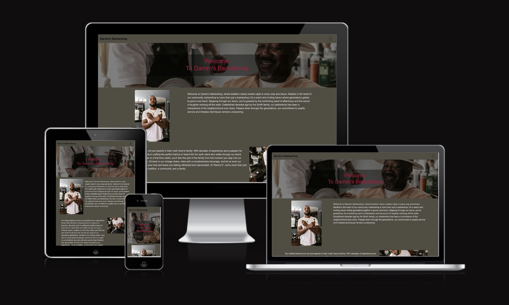
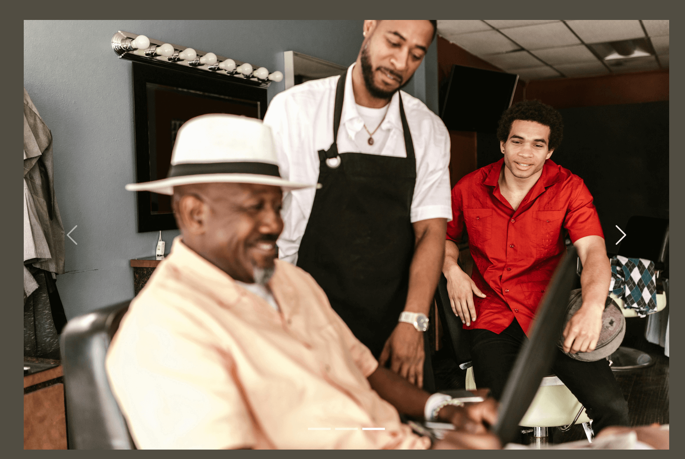
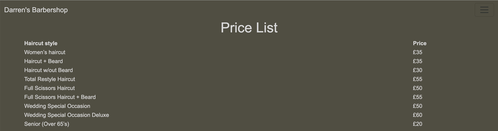

# [WDA PROJECT ONE.GIT](https://rjm8989.github.io/WDA-project-one)

This project was to design a front-end website for Darren's Barbershop. The aims of this project was that the website would generate traffic from a wider audience to help increase the amonut of new customers for the business as well as catering for existing customers through the use of a booking form. The website also has information for new and existing customers such as an decription of each barber, the address, a google map, etc...

--------

source: [amiresponsive](https://ui.dev/amiresponsive?url=https://rjm8989.github.io/WDA-project-one)

## UX

In this section, you will briefly explain your design processes.

### Colour Scheme

Explain your colours and the colour scheme.

- `#D9D9D9` used for primary text.
- `#514d42` used for primary background color.
- `#8f8f8f` used for button and social media links.
- `#A30B37` used for button hover feature.

I used [coolors.co](https://coolors.co/514d42-d9d9d9-a30b370) to generate my colour palette.

### Typography

- [Open Sans](https://fonts.google.com/specimen/Open+Sans) was used for the primary headers, titles and all other secondary text.

- [Font Awesome](https://fontawesome.com) icons were used throughout the site, such as the social media icons in the footer.

## User Stories

In this section, list all of your user stories for the project.

### New Site Users

- As a new site user, I would like to ____________, so that I can ____________.
- As a new site user, I would like to ____________, so that I can ____________.
- As a new site user, I would like to ____________, so that I can ____________.
- As a new site user, I would like to ____________, so that I can ____________.
- As a new site user, I would like to ____________, so that I can ____________.

### Returning Site Users

- As a returning site user, I would like to ____________, so that I can ____________.
- As a returning site user, I would like to ____________, so that I can ____________.
- As a returning site user, I would like to ____________, so that I can ____________.
- As a returning site user, I would like to ____________, so that I can ____________.
- As a returning site user, I would like to ____________, so that I can ____________.

## Wireframes

🛑🛑🛑🛑🛑🛑🛑🛑🛑🛑 START OF NOTES (to be deleted)

In this section, display your wireframe screenshots using a Markdown `table`.
Instructions on how to do Markdown `tables` start on line #213 on this site: https://pandao.github.io/editor.md/en.html

Alternatively, dropdowns are a way to condense several wireframes into a collapsible menu to save space.
Dropdowns in Markdown are considered some of the only acceptable HTML components that are allowed for assessment purposes.

To follow best practice, wireframes were developed for mobile and desktop sizes.
I've used [Figma](https://www.figma.com/files/recents-and-sharing/recently-viewed?fuid=1312128635675800480) to design my site wireframes.

### Desktop Wireframes

These screenshots were taken before the start of the project throughout the design process the pages have slight variations compared to the orginal wireframe.

[Click here to see the Mobile Wireframes]()

Home
  - 

Meet The Team/Contact
  - 

Price List
  - 

### Mobile Wireframes

< details >
< summary > Click here to see the Desktop Wireframes < / summary >

Home
  - 

About
  - 

Contact
  - 

Gallery
  - 

etc.
  - repeat for any remaining desktop wireframes

< / details >

## Features

### Existing Features

- **NAVBAR**

    - The navbar is an interactive feature on the website which allows users to navigate around, the benefit to site is that it allows user to navigate the website easier and find the pages they're either on or wnat to find. 
    

- **CAROSUEL**

    - The carosuel is an interactive feature on the website which allows images to be added to the website, to help adversite the business. 
    At the moment it contains pictures of customers and the staff that work at the company. it allows the user to see types of haircut available and familrise themsleves with the staff.

- **SOCIAL MEDIA LINKS**

    - The social media links show the various social media apps used by the business. It helps to build loyalty and trust in your brand, to help adversite the business and helps to interact directly with customers in real time. It allows the user to interact with the business.

- **GOOGLE MAPS**

    - The Map shows the business location, the benefit of the google map is that its interactive and shows landmarks and transport links around the business. The benefit for the user is that its an interactive map so both existing and current users can plan there journey to the business.

- **PRICE LIST**

    - The pricelist a useful communciation tool it shows the services offered and the price of the services provided by the business, the benefit of the pricelist is that the user know how much a service is and whats on offer at the business

- **BOOKING FORM**

    - The booking form a useful communciation tool it allows both new and existing users, the benefit of the booking form is that new and existing users can book a service, with the staff member they prefer on a choosen day and time they prefer. The benefit to business is that its opens up the business to wider audience and encourges more users.

### Future Features

- BOOKING FORM AND CONTACT US FORM
    - A number of the limitations are the both the booking form and the contact us form.
    The contact us form on html only allows response sent message, whereas with a back-end aplication an e-mail would be sent to the adress of the inquiry, alongside a message comfirmed acknowledgement.

     - With booking form again its only html, so the respsonse is limited and just a 'message received' message. A back-end apllication would allow more interaction such as a calendar to show avialbility of the barbers, the ablility to pay for services directly online and more interaction with customers for example like the Pall Mall barbershop [website](https://www.pallmallbarbers.com/)
  you can see better ineraction they have a booking form via a booking service like Fresha online booking app [website](https://www.fresha.com/), with mulitple locations available, a calendar and choice of staff and service.

- SHOP
    - A shop isn't really realstic without a back-end apllication. A shop would allow more interaction with new and existing customers and a opportunity for the expansion of the business by alowing the business to prodvide grooming products for sale and the ablility for users to pay for services directly online and more interaction with customers for example like the Murdock of London barbershop [website](https://www.murdocklondon.com/) you can see better interaction they have a shop which sells various grooming products.

## Tools & Technologies Used

-  used to generate README and TESTING templates.
-  used for version control. (`git add`, `git commit`, `git push`)
-  used for secure online code storage.
-  used as my local IDE for development.
-  used for the main site content.
-  used for the main site design and layout.
-  used for hosting the deployed front-end site.
-  used as the front-end CSS framework for modern responsiveness and pre-built components.
-  used for the icons.
-  used to help debug, troubleshoot, and explain things.

## Testing

> [!NOTE]  
> For all testing, please refer to the [TESTING.md](TESTING.md) file.

## Deployment

The site was deployed to GitHub Pages. The steps to deploy are as follows:

- In the [GitHub repository](https://github.com/RJM8989/WDA-project-one.git), navigate to the Settings tab 
- From the source section drop-down menu, select the **Main** Branch, then click "Save".
- The page will be automatically refreshed with a detailed ribbon display to indicate the successful deployment.

The live link can be found [here](https://rjm8989.github.io/WDA-project-one)

### Local Deployment

This project can be cloned or forked in order to make a local copy on your own system.

#### Cloning

You can clone the repository by following these steps:

1. Go to the [GitHub repository](https://github.com/RJM8989/WDA-project-one.git) 
2. Locate the Code button above the list of files and click it 
3. Select if you prefer to clone using HTTPS, SSH, or GitHub CLI and click the copy button to copy the URL to your clipboard
4. Open Git Bash or Terminal
5. Change the current working directory to the one where you want the cloned directory
6. In your IDE Terminal, type the following command to clone my repository:
	- `git clone https://github.com/RJM8989/WDA-project-one.git.git`
7. Press Enter to create your local clone.

Alternatively, if using Gitpod, you can click below to create your own workspace using this repository.

Please note that in order to directly open the project in Gitpod, you need to have the browser extension installed.
A tutorial on how to do that can be found [here](https://www.gitpod.io/docs/configure/user-settings/browser-extension).

#### Forking

By forking the GitHub Repository, we make a copy of the original repository on our GitHub account to view and/or make changes without affecting the original owner's repository.
You can fork this repository by using the following steps:

1. Log in to GitHub and locate the [GitHub Repository](https://github.com/RJM8989/WDA-project-one.git)
2. At the top of the Repository (not top of page) just above the "Settings" Button on the menu, locate the "Fork" Button.
3. Once clicked, you should now have a copy of the original repository in your own GitHub account!

### Local VS Deployment

🛑🛑🛑🛑🛑🛑🛑🛑🛑🛑-START OF NOTES (to be deleted)

Use this space to discuss any differences between the local version you've developed, and the live deployment site on GitHub Pages.

🛑🛑🛑🛑🛑🛑🛑🛑🛑🛑-END OF NOTES (to be deleted)

## Credits

In this section you need to reference where you got your content, media, and extra help from.
It is common practice to use code from other repositories and tutorials,
however, it is important to be very specific about these sources to avoid plagiarism.

### Content

🛑🛑🛑🛑🛑🛑🛑🛑🛑🛑-START OF NOTES (to be deleted)

Use this space to provide attribution links to any borrowed code snippets, elements, or resources.
A few examples have been provided below to give you some ideas.

Ideally, you should provide an actual link to every resource used, not just a generic link to the main site!

⚠️⚠️ EXAMPLE LINKS - REPLACE WITH YOUR OWN ⚠️⚠️

🛑🛑🛑🛑🛑🛑🛑🛑🛑🛑-END OF NOTES (to be deleted)

| Source | Location | Notes |
| --- | --- | --- |
| [Markdown Builder](https://tim.2bn.dev/markdown-builder) | README and TESTING | tool to help generate the Markdown files |
| [Chris Beams](https://chris.beams.io/posts/git-commit) | version control | "How to Write a Git Commit Message" |
| [W3Schools](https://www.w3schools.com/howto/howto_js_topnav_responsive.asp) | entire site | responsive HTML/CSS/JS navbar |
| [W3Schools](https://www.w3schools.com/howto/howto_css_modals.asp) | contact page | interactive pop-up (modal) |
| [W3Schools](https://www.w3schools.com/css/css3_variables.asp) | entire site | how to use CSS :root variables |
| [Flexbox Froggy](https://flexboxfroggy.com/) | entire site | modern responsive layouts |
| [Grid Garden](https://cssgridgarden.com) | entire site | modern responsive layouts |
| [StackOverflow](https://stackoverflow.com/a/2450976) | quiz page | Fisher-Yates/Knuth shuffle in JS |
| [YouTube](https://www.youtube.com/watch?v=YL1F4dCUlLc) | leaderboard | using `localStorage()` in JS for high scores |
| [YouTube](https://www.youtube.com/watch?v=u51Zjlnui4Y) | PP3 terminal | tutorial for adding color to the Python terminal |
| [strftime](https://strftime.org) | CRUD functionality | helpful tool to format date/time from string |
| [WhiteNoise](http://whitenoise.evans.io) | entire site | hosting static files on Heroku temporarily |

### Media

🛑🛑🛑🛑🛑🛑🛑🛑🛑🛑-START OF NOTES (to be deleted)

Use this space to provide attribution links to any images, videos, or audio files borrowed from online.
A few examples have been provided below to give you some ideas.

If you're the owner (or a close acquaintance) of all media files, then make sure to specify this.
Let the assessors know that you have explicit rights to use the media files within your project.

Ideally, you should provide an actual link to every media file used, not just a generic link to the main site!
The list below is by no means exhaustive. Within the Code Institute Slack community, you can find more "free media" links
by sending yourself the following command: `!freemedia`.

⚠️⚠️ EXAMPLE LINKS - REPLACE WITH YOUR OWN ⚠️⚠️

🛑🛑🛑🛑🛑🛑🛑🛑🛑🛑-END OF NOTES (to be deleted)

| Source | Location | Type | Notes |
| --- | --- | --- | --- |
| [Pexels](https://www.pexels.com) | entire site | image | favicon on all pages |
| [Lorem Picsum](https://picsum.photos) | home page | image | hero image background |
| [Unsplash](https://unsplash.com) | product page | image | sample of fake products |
| [Pixabay](https://pixabay.com) | gallery page | image | group of photos for gallery |
| [Wallhere](https://wallhere.com) | footer | image | background wallpaper image in the footer |
| [This Person Does Not Exist](https://thispersondoesnotexist.com) | testimonials | image | headshots of fake testimonial images |
| [Audio Micro](https://www.audiomicro.com/free-sound-effects) | game page | audio | free audio files to generate the game sounds |
| [TinyPNG](https://tinypng.com) | entire site | image | tool for image compression |

### Acknowledgements

- I would like to thank my Code Institute mentor, [Tim Nelson](https://github.com/TravelTimN) for his support throughout the development of this project.
- I would like to thank the [Code Institute](https://codeinstitute.net) tutor team for their assistance with troubleshooting and debugging some project issues.
- I would like to thank the [Code Institute Slack community](https://code-institute-room.slack.com) for the moral support; it kept me going during periods of self doubt and imposter syndrome.
- I would like to thank my partner (John/Jane), for believing in me, and allowing me to make this transition into software development.
- I would like to thank my employer, for supporting me in my career development change towards becoming a software developer.
